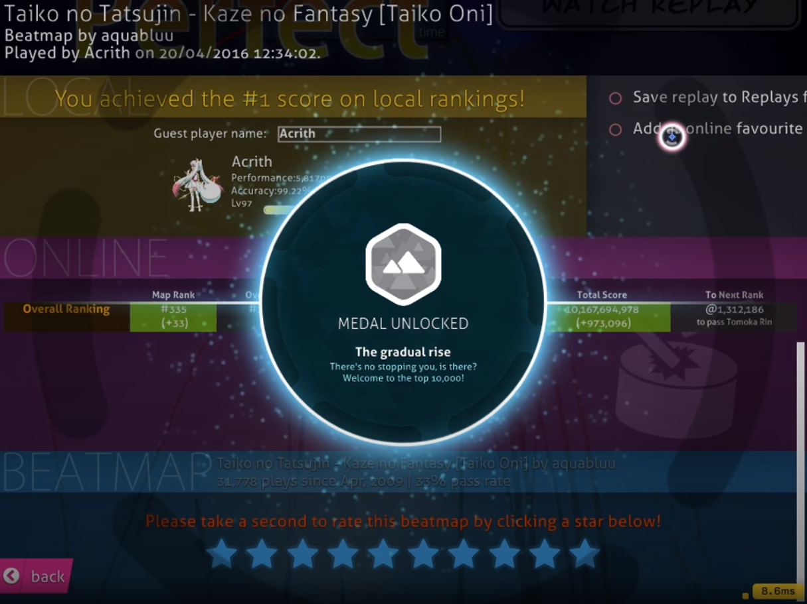
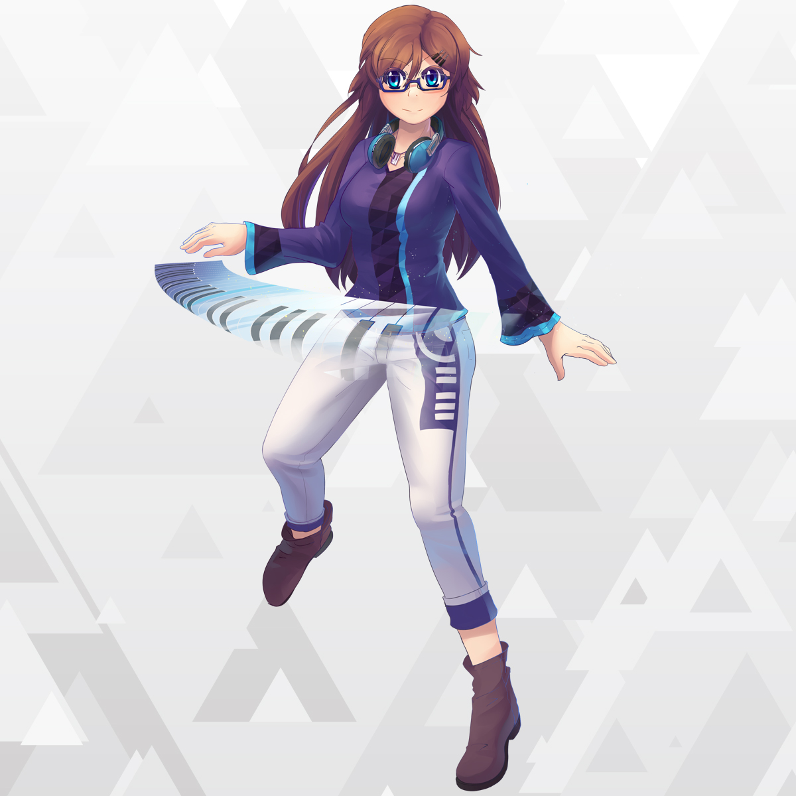

# History of osu! 2016

## January

The ability to see live previews of a selected skin in the options menu was re-added to osu! on 28 January 2016 after having been removed for two years. The feature was initially removed in 2014 due to an options menu refresh in 2014 [[1,2]][r].

## February

On 13 Febuary 2016, controversy sparked across the beatmapping community as a result of then recent changes in the BAT (Beatmap Appreciation Team) and a new rule proposal that attempted to change the then-current beatmapset spread in Ranked beatmaps [[3,4,5]][r]. <!-- DO NOT oversimplify here. I'm gonna leave this to start writing later-->

Two new items were added to the osu!store in Febuary: the osu!mug, and the osu!go. The former being a typical coffee mug with custom osu! designs on them (retailed for $15 USD at launch); the latter was a USB stick that was preloaded with the osu! client, capable of playing osu! directly off of the USB stick (retailed for $50 USD at launch) [[6,7]][r]. <!--dates missing-->

 and the osu!go (right) [[6]][r]")

## March

On the very first day of March, Ephemeral created the first in a series of posts on [peppy's blog](https://blog.ppy.sh "ppy blog") that would become the "Meeting Notes", which served as an attempt to provide more transparency between the osu! team and the community. In these posts, Ephemeral would summarize the main objectives, ideas, and thoughts that the team had towards the future into digestible bullet points. The main thoughts and objectives described in this first post were primarily geared towards improving the team and their communication across the board (with emphasis mapping and modding) [[8]][r].

## April

The modding panel on the new osu! website (new.ppy.sh) was set live for public testing on 11 April 2016; however, public testing was only available for [Ice - L2 - Ascension : Act 2 (Liberation) (LordRaika)](https://osu.ppy.sh/beatmapsets/123760) and [Camellia - overcomplexification (ProfessionalBox)](https://osu.ppy.sh/beatmapsets/351408). According to [Loctav](https://osu.ppy.sh/users/71366), the main idea of the panel was to make every user post every isue individually and discuss it individually for easier tracking of issues and such as part of the steps towards implementing the long awaited Modding V2 [[9]][r]. <!--wayback snapshot broken-->

New medal designs were added into osu! on 14 April 2016 that were more in-line with the "[osu!next](https://osunext.tumblr.com/about "Tumblr")" design philosophy being used in osu!lazer and new website [[10,11]][r]

The first images of osu!mania's official mascot, Maria, were posted for the first time on 20 April 2016. In celebration of Maria's introduction to the community, a brand new medal named "A meganekko approaches" (obtained by achieving 100 combo on any beatmap in osu!mania) was added to the game along with a sprite of Maria being used in combo milestone bursts in osu!mania [[13]][r].

The QAT (Quality Assurance Team) and their involvement in the beatmapping and modding process was significantly changed on 25 April 2016. The changes made were described by [Loctav](https://osu.ppy.sh/users/71366) in a forum post at the time:

> Going forward, the QAT will no longer be obligated to check every qualified beatmap for quality checks. Instead, they will be reactive in nature, responding to and addressing reports made by members of the community about a map’s quality.
>
> We want to return the responsibility for mapping quality and content to the community at large, rather than delegating it to a small group of people to enforce. We believe this change will achieve this.
>
> ...
>
> Going forward, we will also be releasing a Code of Conduct regarding Mapping and Modding affairs. This will ensure that there will be a base level of respect in the talks surrounding these issues, as they have been prone to problems in the past. Ultimately, all parties involved in the ranking/mapping process have the same ultimate goal - to get cool stuff ranked and available for play as quickly as possible with as little issue as possible.

— Loctav, "Changes to the Quality Assurance Team" [[14]][r]

Reception towards this change was overall mostly positive by the community; however, some users did have concerns about whether or not this change would cause some beatmaps to become ignored without a guaranteed mod by a QAT member [[14]][r].

## May

The very first osu! remix contest began on 6 May 2016. "osu! remix" was a new type of contest that challenged participants to make a remix of the song "[circles!](https://soundcloud.com/nekodex/circles "SoundCloud")" by [nekodex](https://osu.ppy.sh/users/102). As reward, the grand prize winner (chosen by osu! staff) would have their remix featured in osu! along with $250 USD in osu!store credit, a profile badge, and an official beatmapping contest featuring the remix; a secondary winner (chosen by community vote) would recieve $50 USD in osu!store credit. The deadline for the contest was set to be 9 July 2016 (00:00:00 UTC) [[15]][r].

A request for "early bird contributors" was amade by [peppy](https://osu.ppy.sh/users/2) on 18 May 2016. The request specifically asked for individuals with enough free time, knowledge in [C#](https://en.wikipedia.org/wiki/C_Sharp_(programming_language) "Wikipedia") 6.0, and were willing and able to help clean-up and refractor large areas of the code base for osu!lazer. peppy also later asked for "reinforcements" in the form of more "early bird contributors" that were familiar with [Laravel](https://en.wikipedia.org/wiki/Laravel "Wikipedia") and [React](https://en.wikipedia.org/wiki/React_(JavaScript_library) "Wikipedia").

## June

Mapping With Rewards \#1, announced in the previous year, has finally been concluded. osu!idol 2016 opened. peppy announced osu!lazer, the soon-to-be successor of the current osu! client.

Links:

- [Mapping With Rewards #1 - Bounties Complete!](https://osu.ppy.sh/home/news/2016-06-01-mapping-with-rewards-1-bounties-complete)
- [osu!idol 2016 - Registrations open!](https://osu.ppy.sh/home/news/2016-06-03-osuidol-2016-registrations-open)
- [a long-overdue update – ppy blog](https://blog.ppy.sh/post/146687255823/a-long-overdue-update)

## July

[Aspire](/wiki/Aspire) 2 concluded with [Monstrata](https://osu.ppy.sh/users/2706438) as the Aspirant. osu! remix contest voting opened. The osu! team opened an osu!taiko design contest, as osu!taiko has yet to have one.

Links:

- [Aspire 2 Concludes: Winners Announced](https://osu.ppy.sh/home/news/2016-07-23-aspire-2-concludes-winners-announced)
- [osu! mascot design contest](https://osu.ppy.sh/home/news/2016-07-18-osu-mascot-design-contest)
- [osu!Remix Contest Community Vote!](https://osu.ppy.sh/home/news/2016-07-31-osuremix-contest-community-vote)

## August

A new set of Hush-Hush [medals](/wiki/Medals) were released. Previously, no one was allowed to discuss ways on obtaining these medals; however, going forward, it is encouraged to work together on figuring out ways to obtain these medals. Voting for the osu!taiko mascot fanart contest was opened. The osu! remix contest voting concluded with [BilliumMoto](https://osu.ppy.sh/users/3862471) taking the grand prize. osu! just ticked over 5 billion ranked plays!

Links:

- [New Hush-Hush Medals!](https://osu.ppy.sh/home/news/2016-08-17-new-hush-hush-medals)
- [osu!taiko mascot voting](https://osu.ppy.sh/home/news/2016-08-22-osutaiko-mascot-voting)
- [osu!remix contest #1: Results](https://osu.ppy.sh/home/news/2016-08-29-osuremix-contest-1-results)
- [osu! on Twitter](https://twitter.com/osugame/status/770153577255796737)

## September

[osu!mania 4k World Cup](/wiki/Tournaments/MWC/2016_4K) concluded with South Korea being victorious against Brazil. peppy tweeted regarding the 9th anniversary of osu!; however, stated that there nothing was planned for this year. The osu!taiko mascot voting results were in, peppy reminds that the community picked winner was *not* the new mascot since the osu!team wanted to take more into account than the mascots' loliciousness. [yuki.](https://osu.ppy.sh/beatmaps/artists/4), a brand new osu!musician, entered the stage with a new community mapping contest.

Links:

- [osu!mania 4K World Cup Results!](https://osu.ppy.sh/home/news/2016-09-10-osumania-4k-world-cup-results)
- [Dean Herbert on twitter](https://twitter.com/ppy/status/777101188277739522)
- [osu!taiko Mascot Community Vote Results](https://osu.ppy.sh/home/news/2016-09-21-osutaiko-mascot-community-vote-results)
- [Community Mapping Contest \#1 - yuki. (Nadeshiko Sensation)](https://osu.ppy.sh/home/news/2016-09-28-community-mapping-contest-1-yuki-nadeshiko)

## October

osu! World Cup 2016 registrations opened. GML applications were opened for those who wish to join. The [loved](/wiki/Beatmap/Category#loved) beatmap status was introduced in its testing stage as a way to give community-loved, but unrankable, beatmaps leaderboards. Those types of beatmaps will, however, not award [pp](/wiki/Performance_Points) and their leaderboards could be deleted for when the creator updates their beatmap. The Halloween-themed 7th fanart contest opened. Loved was in its second testing state, ready for a new batch of beatmaps to enter this category. A new video featuring osu!lazer was released. Most notably, the hit circles had more textures to them and gave off a smooth and shiny look. osu!idol 2016 voting were opened. A few days before Halloween, the Halloween fanart contest was opened and concluded two days later. The osu!weekly released the 78th issue on Halloween, making it as spooky as possible (but where did the 77th issue go? We'll never know).

Links:

- [osu! World Cup 2016 - Registrations now open!](https://osu.ppy.sh/home/news/2016-10-02-osu-world-cup-2016-registrations-now-open)
- [GMT Applications Now Open](https://osu.ppy.sh/home/news/2016-10-15-gmt-applications-now-open)
- [Here Comes the Love](https://osu.ppy.sh/home/news/2016-10-17-here-comes-the-love)
- [Flash Fanart Contest \#7: Halloween](https://osu.ppy.sh/home/news/2016-10-19-flash-fanart-contest-7-halloween)
- [Show Your Love!](https://osu.ppy.sh/home/news/2016-10-21-show-your-love)
- [osu!weekly \#76](https://osu.ppy.sh/home/news/2016-10-24-osuweekly-76)
- [osu!idol 2016 Finals - Community Voting](https://osu.ppy.sh/home/news/2016-10-25-osuidol-2016-finals-community-voting)
- [Halloween Fanart Contest Voting Begins!](https://osu.ppy.sh/home/news/2016-10-27-halloween-fanart-contest-voting-begins)
- [Halloween Cometh](https://osu.ppy.sh/home/news/2016-10-29-halloween-cometh)
- [osu!weekly \#78 (Extra Spooky Edition)](https://osu.ppy.sh/home/news/2016-10-31-osuweekly-78-extra-spooky-edition)

## November

Starting off in November, a new batch of [community contributors](/wiki/People/Community_Contributors) were announced. [ztrot](https://osu.ppy.sh/users/6347) and [deadbeat](https://osu.ppy.sh/users/128370) observes the history of osu! regarding its UI/UX from its beginnings to its present. [Slyleaf](https://osu.ppy.sh/users/3322032) takes 1st place in osu!idol 2016. Ending November, the Christmas-themed 8th fanart contest opened.

Links:

- [Recognising the Best of the Best](https://osu.ppy.sh/home/news/2016-11-02-recognising-the-best-of-the-best)
- [A History of osu!: Episode One](https://osu.ppy.sh/home/news/2016-11-04-a-history-of-osu-episode-one)
- [osu!idol 2016 Final results](https://osu.ppy.sh/home/news/2016-11-08-osuidol-2016-final-results)
- [Fanart Contest #8: Christmas!](https://osu.ppy.sh/home/news/2016-11-28-fanart-contest-8-christmas)

## December

Voting for the community beatmapping contest \#1 (announced back in September) was opened. Monthly beatmapping contest \#13 was opened. osu!mania 7K World Cup 2017 registrations was opened. [cYsmix](https://osu.ppy.sh/beatmaps/artists/2) had outdone himself and produced a beautiful festive intro track for Christmas, which can be heard upon opening the game. [Loki/Thaehan](https://osu.ppy.sh/beatmaps/artists/7) and [sakuraburst](https://osu.ppy.sh/beatmaps/artists/8) were announced to be the newest featured artists in osu!. osu! World Cup 2016 concluded with United States overtaking China. A day past Christmas, the Christmas fanart contest resulted with [\[ Piyori \]](https://osu.ppy.sh/users/4457608) capturing the most votes.

Links:

- [Community Mapping Contest \#1 Voting Live](https://osu.ppy.sh/home/news/2016-12-02-community-mapping-contest-1-voting-live)
- [Monthly Beatmapping Contest #13 Now Open!](https://osu.ppy.sh/home/news/2016-12-09-monthly-beatmapping-contest-13-now-open)
- [osu!mania 7K World Cup 2017 - Registrations now open!](https://osu.ppy.sh/home/news/2016-12-12-osumania-7k-world-cup-2017-registrations-now)
- [New Featured Artist: Loki/Thaehan](https://osu.ppy.sh/home/news/2016-12-13-new-featured-artist-lokithaehan)
- [Season's Greetings From osu!](https://osu.ppy.sh/home/news/2016-12-19-seasons-greetings-from-osu)
- [New Featured Artist: sakuraburst](https://osu.ppy.sh/home/news/2016-12-20-new-featured-artist-sakuraburst)

---

## References

1. [osu!weekly #47](https://osu.ppy.sh/home/news/2016-02-09-osuweekly-47)
2. [28 January 2016 changelog](https://osu.ppy.sh/home/changelog/cuttingedge/20160128)
3. [Mapset and Spread Restructure (Proposed)](https://osu.ppy.sh/community/forums/topics/420223)
4. [MEET EPHEMERAL!](https://blog.ppy.sh/post/139478794378/meet-ephemeral)
5. [Timeline of Events Surrounding Recent Changes](https://docs.google.com/document/d/1VlFUIte8ho4tssRCucSBt96nTVAhsCLfJZcFVgzHjuk/edit)
6. [osu!weekly #48](https://osu.ppy.sh/home/news/2016-02-16-osuweekly-48)
7. [osu!go not worth it?](https://osu.ppy.sh/community/forums/topics/425108)
8. [2016-02 MEETING NOTES](https://blog.ppy.sh/post/140259300353/2016-02-meeting-notes)
9. [Modding v2: Modding Panel - Feedback Thread](https://osu.ppy.sh/community/forums/topics/442285)
10. [osu!weekly #57](https://osu.ppy.sh/home/news/2016-04-20-osuweekly-57)
11. [15 April 2016 changelog](https://osu.ppy.sh/home/changelog/cuttingedge/20160415)
12. [osu! | How medals looks like? (Animations) | Achievements 20/04/2016](https://www.youtube.com/watch?v=sdGe-Gv38Yw)
13. [Meet Maria - osu!mania's new mascot!](https://osu.ppy.sh/home/news/2016-04-20-meet-maria-osumanias-new-mascot)
14. [Changes to the Quality Assurance Team](https://osu.ppy.sh/community/forums/topics/447417)
15. [osu! "circles!" Remix Contest](https://osu.ppy.sh/home/news/2016-05-06-osu-circles-remix-contest)
16. [EARLY-BIRD CONTRIBUTORS](https://blog.ppy.sh/post/144539340703/early-bird-contributors)
17. [31 May 2016 (6:22 AM UTC)](https://twitter.com/ppy/status/737529593184149504)

[r]: #references
